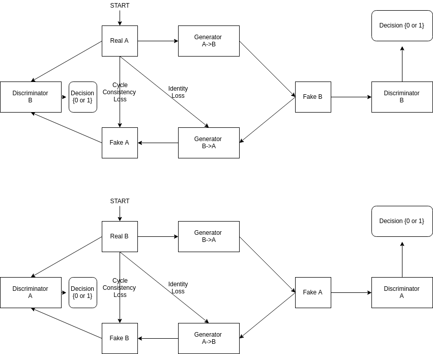
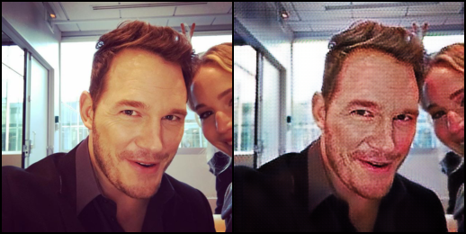
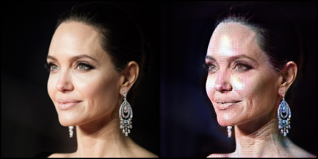

# CycleGANs-PyTorch applied on Young to Old image converter.
Py-Torch implementation of [CycleGANs Paper](https://arxiv.org/pdf/1703.10593.pdf).
* You can find more about this project in my [blog here](http://blog.abhishekyana.ml/implement-your-own-young-to-old-age-converter-app-in-pytorch-using-cyclegans/).
### CycleGAN Block Diagram:

### RESULTS FIRST: Young to Old converter




### IF you want to replicate these results may be on different dataset. Read More..
1. Clone the repository:
```
git clone https://github.com/abhishekyana/CycleGANs-PyTorch.git
cd CycleGANs-PyTorch
# As this is a huge project, I'd suggest to make a conda environment and then run the training and all.
```
1. Install all the requirements from requirements.txt file:
1. Download the dataset, It can be grabbed from [here](https://www.kaggle.com/abhishekyana/young2old-dataset).
1. Unzip and Move the dataset folder into this project's root directory.
1. Adjust the configure.py file according to your flavour, these parameters affect the training.
1. Run the `python train.py` file and see the training happen for yourself.
* The models will be saved to and loaded from ./outputs as default.
* The model trained for around 4 hours on GTX1080 and i7 system.

### If you want to test the mode, then you can download the pretrained model [from here](./). Sorry the link is broken I'll fix it..
* Download the dataset.
* Download the pretrained model. Only Generator model is enough.
* Copy these folders into appropriate directories as mentioned above.
* Run `python test.py`, After the provess is done, you can see the Juxtaposed results in `./outputs/A` and `./outputs/B`.
* If you want to run this on your own images, Copy your image into a directory in `./directory/A` if you want to make your picture old or into `./directory/B` if you want your picture to be Young. Then edit the `./directory` in testoptions in `configure.py` and run the code again. Now, you can see the your image in the outputs directory.

### Please Feel Free to Fork it, Clone it and whatever you want.
* Not only this data, A CycleGAN can map from any unpaired domains, as this application si trending now, I've chosen this to code. 
## With Love on Open Source
### Thank you
This project is inspired from [Aitor Ruano](https://github.com/aitorzip) and I would like to thank him for providing such a beautiful code which I used to clarify my doubts during the implementation.
